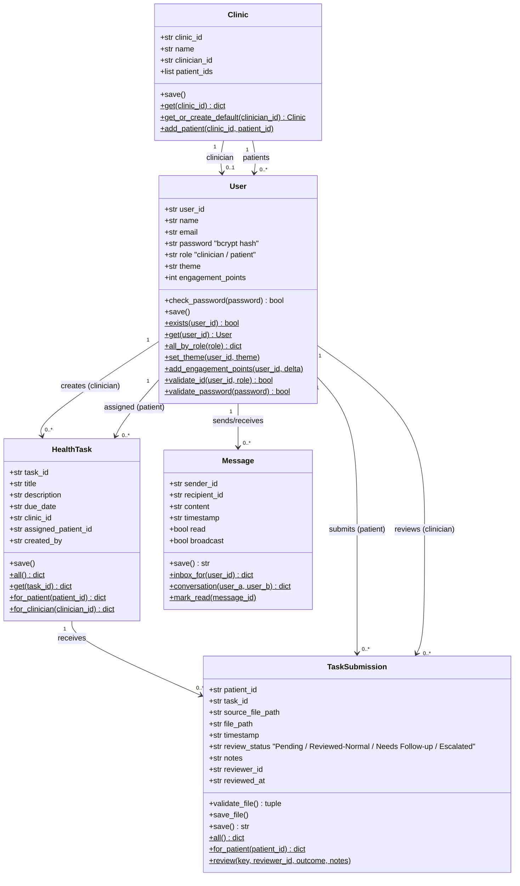

# Class Diagram — ClinicCare-Lite

Matches `models/*.py`. Every class owns its own JSON persistence
(`load_json`/`save_json` from `utils/json_store.py`) and behaviour;
`app.py` routes only handle HTTP input/output and call these methods.

## Notes

- **No numeric grade.** `TaskSubmission.review_status` is one of four
  categorical outcomes (`config.REVIEW_OUTCOMES`), never a 0-100 score — see
  the course spec's explicit requirement that health data get administrative
  triage, not a grade.
- **Engagement Points are private by construction.** `add_engagement_points`
  only ever mutates the calling patient's own record; there is no method
  that reads or ranks points across patients (no leaderboard route exists in
  `app.py`).
- **`TaskSubmission.save_file()` validates before touching the filesystem.**
  Extension and size are checked (`validate_file`) before the file is copied
  into `submissions/<patient_id>/`, so a rejected upload never reaches disk.
- **Single shared `Clinic`** — `get_or_create_default()` is a known
  simplification; see `cliniccare-lite/README.md`'s "Known simplification"
  section for the multi-clinic extension path.
