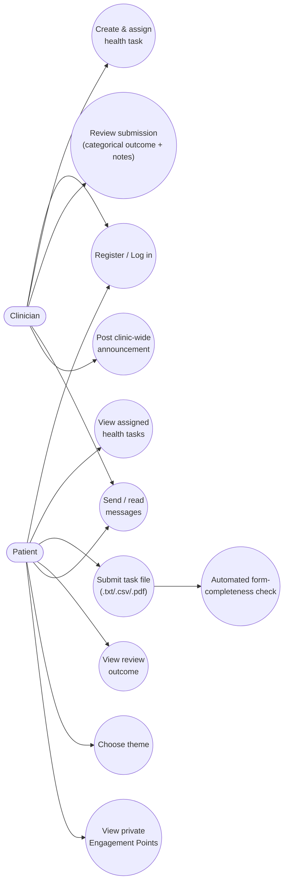

# Use-Case Diagram — ClinicCare-Lite

Two roles. Scope boundary applies to every use case below: nothing here
diagnoses, interprets symptoms, or recommends treatment — see the root
README's "Project boundaries" section.

## Actor -> permitted action matrix

| Action | Clinician | Patient |
|---|:---:|:---:|
| Register / log in | Yes | Yes |
| Create & assign a health task | Yes | No |
| View own assigned tasks | No | Yes |
| Submit a task file | No | Yes |
| Review a submission (categorical outcome) | Yes | No |
| View own review outcomes | No | Yes |
| Send / read messages | Yes | Yes |
| Post clinic-wide announcement | Yes | No |
| View own Engagement Points | No | Yes (own only, never compared) |
| Choose interface theme | Default: dark | Colourful or dark |

## Out of scope (explicitly excluded)

Per the course spec's hard scope boundary, none of the following are use
cases of this system, and no future feature should add them without
revisiting the boundary:

- Diagnosing a patient or interpreting the clinical meaning of a submission.
- Recommending treatment or medication.
- Ranking or comparing patients' engagement/attendance against each other.
