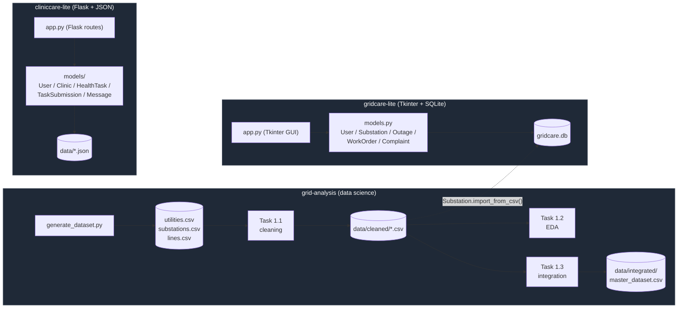

# System Architecture

Three independent components share one repository and one dataset lineage.
Nothing shares a database or a running process — the only coupling is that
`grid-analysis` produces the substation reference data that `gridcare-lite`
imports.

## Why this shape

- **No shared runtime.** `grid-analysis` is a batch pipeline (scripts + a
  pytest suite), `gridcare-lite` is a desktop app, `cliniccare-lite` is a web
  app. They can be developed, tested, and demoed independently — a bug in one
  never blocks the other two.
- **One directional data dependency.** `gridcare-lite` optionally imports
  `grid-analysis`'s cleaned substation list so outages can only be logged
  against a real substation (`Substation.import_from_csv`, see
  `gridcare-lite/README.md`). Nothing flows the other way, and
  `cliniccare-lite` has no dependency on either.
- **Each app owns its persistence.** SQLite for `gridcare-lite` (relational:
  outages reference substations and technicians by ID, work orders reference
  outages), JSON files for `cliniccare-lite` (document-shaped: a submission
  or message is naturally a single record, not a joined row).
- **The GUI layer never touches storage directly.** Both apps route every
  read/write through a domain class (`gridcare-lite/models.py`,
  `cliniccare-lite/models/*.py`) — screens/routes only handle input and
  layout. See each component's `docs/class_diagram.md`.

## Component docs

- [grid-analysis/docs/entity_relationship_diagram.md](../grid-analysis/docs/entity_relationship_diagram.md)
  and [data_dictionary.md](../grid-analysis/docs/data_dictionary.md)
- [gridcare-lite/docs/class_diagram.md](../gridcare-lite/docs/class_diagram.md),
  [use_case_diagram.md](../gridcare-lite/docs/use_case_diagram.md),
  [er_diagram.md](../gridcare-lite/docs/er_diagram.md)
- [cliniccare-lite/docs/class_diagram.md](../cliniccare-lite/docs/class_diagram.md),
  [use_case_diagram.md](../cliniccare-lite/docs/use_case_diagram.md)
