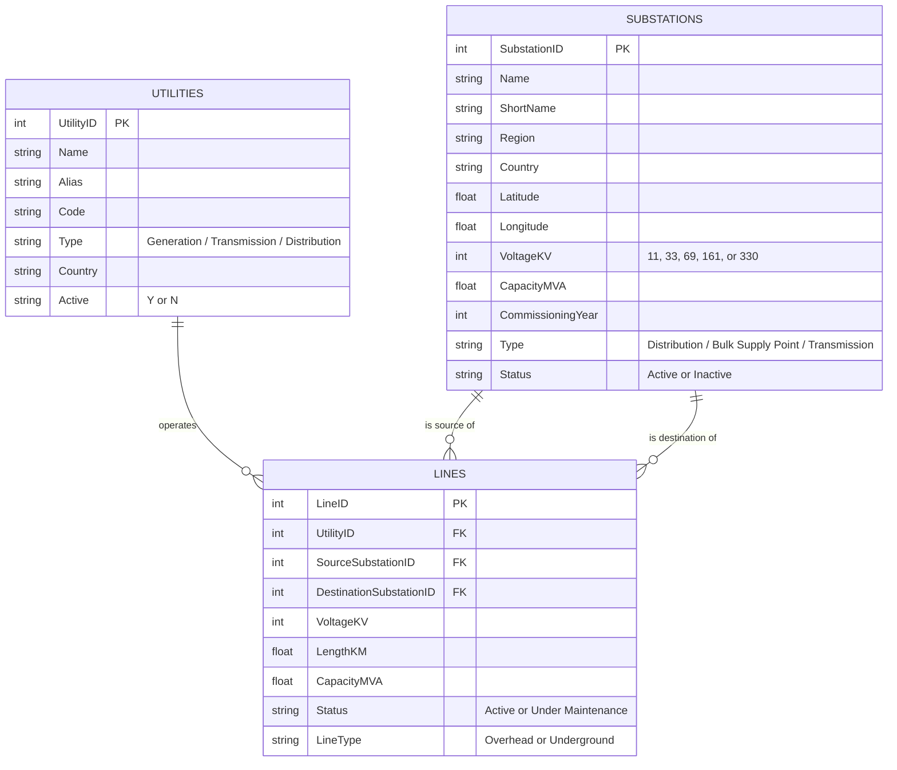

# Entity-Relationship Diagram — National Electricity Grid Network Analysis

Three tables, generated by `generate_dataset.py` and cleaned by Task 1.1:
`utilities`, `substations`, and `lines`. `lines` is the join table connecting
the other two — every line references exactly one utility (who operates it)
and exactly two substations (the source and destination ends).

## Relationships and cardinality

| Relationship | Cardinality | Enforced by |
|---|---|---|
| `utilities.Utility ID` -> `lines.Utility ID` | One utility operates many lines | `Task 1.1`'s FK validation (`validate_relationships`) checks every `lines.Utility ID` exists in `utilities` |
| `substations.Substation ID` -> `lines.Source Substation ID` | One substation is the source of many lines | Same validation, applied to the source-side FK |
| `substations.Substation ID` -> `lines.Destination Substation ID` | One substation is the destination of many lines | Same validation, applied to the destination-side FK |

`lines` therefore has **three** foreign keys into two parent tables — this is
why `Task 1.3`'s integration script performs *two* separate merges against
`substations` (one for the source end, one for the destination end, with
`_source`/`_destination` suffixes) plus one merge against `utilities`, rather
than a single three-way join.

## Why this isn't modelled as a graph database

For Task 2.1 (Network Analysis), the same three tables are reinterpreted as a
graph: each row in `substations` becomes a node, and each row in `lines`
becomes an undirected edge between its source and destination node. The
relational structure above is what Task 1.3's integration step validates and
flattens *before* that graph is built — NetworkX itself is not queried via
foreign keys, so the relational integrity checked here is what guarantees the
graph-construction step in Task 2.1 doesn't silently drop or misattribute an
edge.
