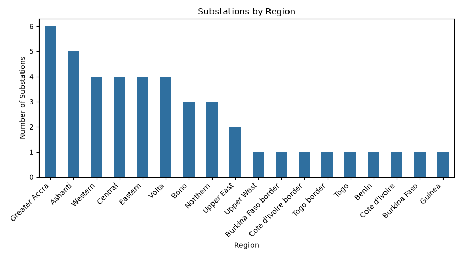
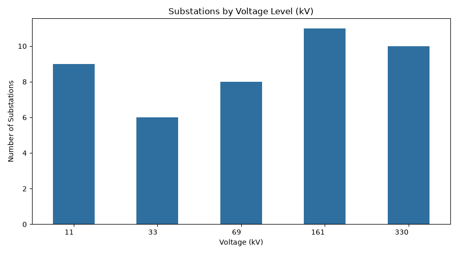
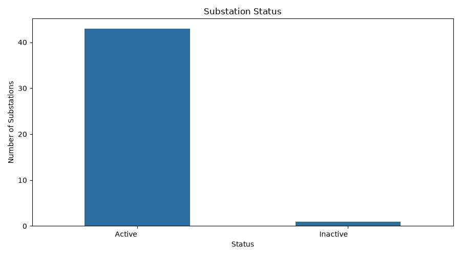
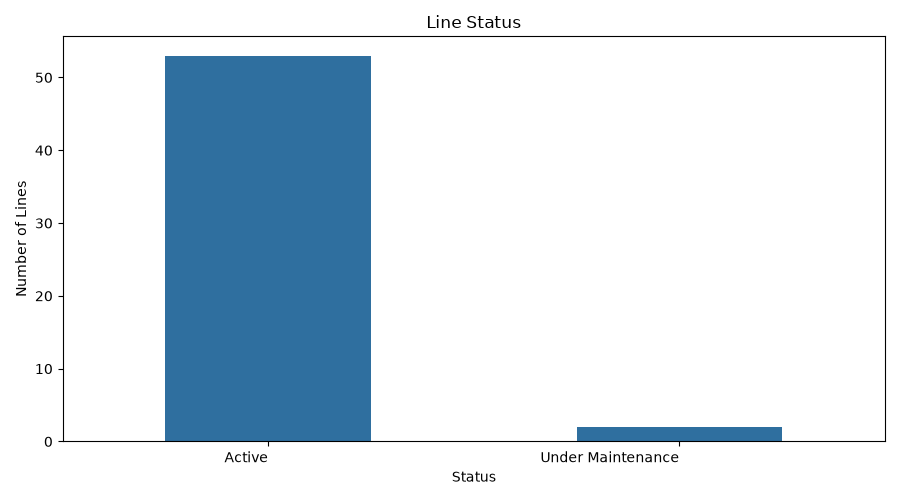
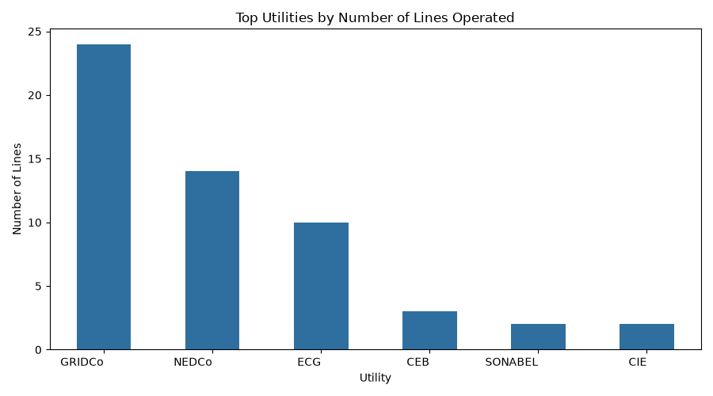
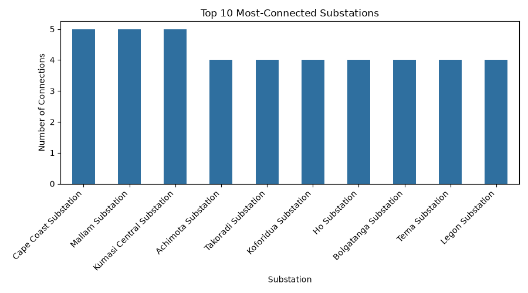
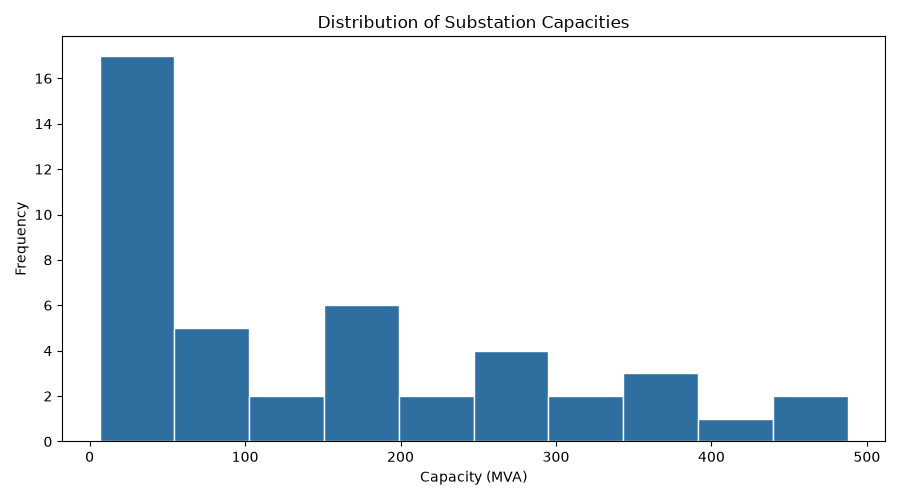
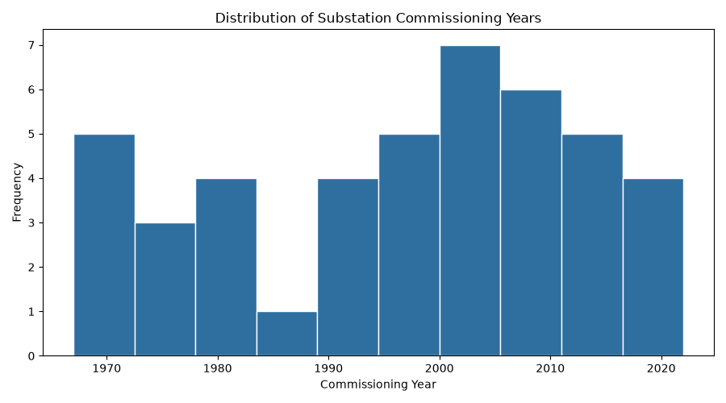

# Task 1.2 - Exploratory Data Analysis Report

_Generated 2026-08-02T16:15:34_

_Source: `data/cleaned/*.csv` (Task 1.1 output)._

## 1. Descriptive statistics for numerical variables

### Substations

| stat  | Latitude | Longitude | Voltage (kV) | Capacity (MVA) | Commissioning Year |
| ----- | -------- | --------- | ------------ | -------------- | ------------------ |
| count | 44.0     | 44.0      | 44.0         | 44.0           | 44.0               |
| mean  | 6.9      | -1.19     | 134.55       | 157.87         | 1996.3             |
| std   | 1.88     | 2.31      | 120.4        | 139.92         | 16.11              |
| min   | 4.87     | -13.58    | 11.0         | 6.4            | 1967.0             |
| 25%   | 5.59     | -1.76     | 33.0         | 43.82          | 1982.25            |
| 50%   | 6.18     | -0.8      | 69.0         | 108.55         | 1999.5             |
| 75%   | 7.36     | -0.17     | 161.0        | 254.35         | 2009.25            |
| max   | 11.2     | 2.43      | 330.0        | 487.6          | 2022.0             |

### Lines

| stat  | Voltage (kV) | Length (km) | Capacity (MVA) |
| ----- | ------------ | ----------- | -------------- |
| count | 55.0         | 55.0        | 55.0           |
| mean  | 141.38       | 99.31       | 222.4          |
| std   | 135.17       | 90.28       | 109.18         |
| min   | 11.0         | 3.8         | 32.9           |
| 25%   | 22.0         | 42.9        | 134.55         |
| 50%   | 69.0         | 75.9        | 229.9          |
| 75%   | 330.0        | 129.6       | 292.1          |
| max   | 330.0        | 426.0       | 506.3          |

## 2. Frequency distributions for categorical variables

### Substations by Region

| Region               | Count |
| -------------------- | ----- |
| Greater Accra        | 6     |
| Ashanti              | 5     |
| Western              | 4     |
| Central              | 4     |
| Eastern              | 4     |
| Volta                | 4     |
| Bono                 | 3     |
| Northern             | 3     |
| Upper East           | 2     |
| Upper West           | 1     |
| Burkina Faso border  | 1     |
| Cote d'Ivoire border | 1     |
| Togo border          | 1     |
| Togo                 | 1     |
| Benin                | 1     |
| Cote d'Ivoire        | 1     |
| Burkina Faso         | 1     |
| Guinea               | 1     |

### Substations by Voltage Level (kV)

| Voltage (kV) | Count |
| ------------ | ----- |
| 11           | 9     |
| 33           | 6     |
| 69           | 8     |
| 161          | 11    |
| 330          | 10    |

### Substation Status

| Status   | Count |
| -------- | ----- |
| Active   | 43    |
| Inactive | 1     |

### Line Status (Active / Under Maintenance)

| Status            | Count | Percent |
| ----------------- | ----- | ------- |
| Active            | 53.0  | 96.4    |
| Under Maintenance | 2.0   | 3.6     |

## 3. Top utilities by number of lines operated

| rank | Utility | Line Count |
| ---- | ------- | ---------- |
| 0    | GRIDCo  | 24         |
| 1    | NEDCo   | 14         |
| 2    | ECG     | 10         |
| 3    | CEB     | 3          |
| 4    | SONABEL | 2          |
| 5    | CIE     | 2          |

## 4. Most-connected substations

| Substation                | Connections | Region        |
| ------------------------- | ----------- | ------------- |
| Cape Coast Substation     | 5           | Central       |
| Mallam Substation         | 5           | Greater Accra |
| Kumasi Central Substation | 5           | Ashanti       |
| Achimota Substation       | 4           | Greater Accra |
| Takoradi Substation       | 4           | Western       |
| Koforidua Substation      | 4           | Eastern       |
| Ho Substation             | 4           | Volta         |
| Bolgatanga Substation     | 4           | Upper East    |
| Tema Substation           | 4           | Greater Accra |
| Legon Substation          | 4           | Greater Accra |

## 5. Substation capacity distribution

| stat  | Capacity (MVA) |
| ----- | -------------- |
| count | 44.0           |
| mean  | 157.87         |
| std   | 139.92         |
| min   | 6.4            |
| 25%   | 43.82          |
| 50%   | 108.55         |
| 75%   | 254.35         |
| max   | 487.6          |

### Highest-capacity substations and their region

| rank | Short Name               | Region               | Capacity (MVA) | Voltage (kV) |
| ---- | ------------------------ | -------------------- | -------------- | ------------ |
| 0    | Cotonou Transmission Hub | Benin                | 487.6          | 161          |
| 1    | Bobo-Dioulasso Hub       | Burkina Faso         | 445.9          | 161          |
| 2    | Aflao Border Station     | Togo border          | 423.2          | 330          |
| 3    | Nkawkaw                  | Eastern              | 389.2          | 69           |
| 4    | Ho                       | Volta                | 382.1          | 330          |
| 5    | Ejisu                    | Ashanti              | 355.9          | 330          |
| 6    | Suhum                    | Eastern              | 339.0          | 69           |
| 7    | Bolgatanga               | Upper East           | 325.9          | 161          |
| 8    | Konongo                  | Ashanti              | 285.2          | 69           |
| 9    | Elubo Border Station     | Cote d'Ivoire border | 285.1          | 330          |

## 6. Infrastructure age by region

| Region               | mean   | min    | max    | count |
| -------------------- | ------ | ------ | ------ | ----- |
| Upper West           | 1977.0 | 1977.0 | 1977.0 | 1.0   |
| Upper East           | 1981.5 | 1971.0 | 1992.0 | 2.0   |
| Burkina Faso         | 1983.0 | 1983.0 | 1983.0 | 1.0   |
| Cote d'Ivoire border | 1984.0 | 1984.0 | 1984.0 | 1.0   |
| Northern             | 1987.3 | 1969.0 | 2015.0 | 3.0   |
| Western              | 1987.8 | 1967.0 | 2010.0 | 4.0   |
| Burkina Faso border  | 1991.0 | 1991.0 | 1991.0 | 1.0   |
| Central              | 1991.2 | 1970.0 | 2003.0 | 4.0   |
| Benin                | 1995.0 | 1995.0 | 1995.0 | 1.0   |
| Greater Accra        | 1995.7 | 1970.0 | 2011.0 | 6.0   |
| Volta                | 1998.2 | 1980.0 | 2017.0 | 4.0   |
| Eastern              | 2003.8 | 1975.0 | 2021.0 | 4.0   |
| Ashanti              | 2004.0 | 1989.0 | 2018.0 | 5.0   |
| Guinea               | 2004.0 | 2004.0 | 2004.0 | 1.0   |
| Bono                 | 2007.0 | 1999.0 | 2022.0 | 3.0   |
| Cote d'Ivoire        | 2010.0 | 2010.0 | 2010.0 | 1.0   |
| Togo                 | 2014.0 | 2014.0 | 2014.0 | 1.0   |
| Togo border          | 2015.0 | 2015.0 | 2015.0 | 1.0   |

## 7. Initial hypotheses about network structure

- **Greater Accra** has the greatest number of substations (6), suggesting it is the network's primary load centre - consistent with it typically covering the capital/major urban area in this kind of dataset.

- **GRIDCo** operates the most lines (24), which may reflect either broad geographic coverage or a transmission-utility role rather than a distribution-utility role - worth cross-checking against the 'Type' column in utilities.csv in Task 1.3.

- **Cape Coast Substation** is the most-connected substation in the network (5 connections). A node with this many connections is a structural hub candidate; Task 2.1's betweenness- centrality calculation should confirm whether it is also a critical inter-regional bridge or 'merely' a well-meshed local hub.

- **Upper West** has the oldest average infrastructure (mean commissioning year 1977.0), while **Togo border** has the newest (mean 2015.0). Older assets are a reasonable proxy for elevated fault risk and should be cross-referenced against maintenance status in Task 2.3.

- **3.6%** of lines are currently 'Under Maintenance'. If this proportion is concentrated in a small number of regions or utilities rather than spread evenly, that concentration itself is worth flagging as an operational risk indicator.

## 8. Patterns for further investigation

- Does substation degree (connection count) correlate with capacity (MVA), or are some high-degree substations low-capacity 'wiring hubs' rather than genuine bulk-supply points? Investigate in Task 2.1/2.3.

- Do high-capacity substations cluster geographically (e.g. along the coast or around Accra/Kumasi), or are they evenly spread? Investigate with the geospatial analysis in Task 2.2.

- Is there a relationship between a substation's voltage tier and its commissioning year (i.e. are higher-voltage transmission assets newer or older than lower-voltage distribution assets)?

- Are cross-border WAPP interconnection substations structurally more central (higher betweenness) than domestic hubs, given they sit between otherwise separate national sub-networks?

- Does line length correlate with line capacity or voltage - i.e. are longer lines built to a consistently higher spec, or does the dataset show under-provisioned long-haul lines worth flagging as upgrade candidates in Task 2.3?

## 9. Figures

- `figures/task_1_2/eda_regions.png`

- `figures/task_1_2/eda_voltage_distribution.png`

- `figures/task_1_2/eda_top_utilities.png`

- `figures/task_1_2/eda_top_connected_substations.png`

- `figures/task_1_2/eda_status_distribution.png`

- `figures/task_1_2/eda_line_status_distribution.png`

- `figures/task_1_2/eda_capacity_histogram.png`

- `figures/task_1_2/eda_commissioning_year_histogram.png`
