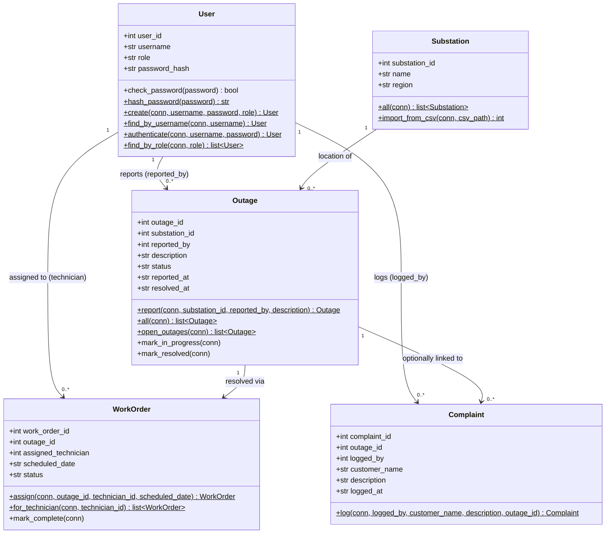

# Class Diagram — GridCare-Lite

Matches `models.py`. Every class owns its own data access and behaviour;
`app.py` only calls these methods (see `docs/architecture.md` at the repo
root for why).

## Notes

- **State transitions live on the class that owns them, once.**
  `WorkOrder.assign()` also flips its outage to `"In Progress"`;
  `WorkOrder.mark_complete()` also flips its outage to `"Resolved"`. A screen
  never sets `outage.status` directly, so the two tables can't drift apart.
- **Validation raises `ValueError`, screens catch it.** E.g. an empty outage
  description, a missing scheduled date, or a `Complaint` linked to a
  nonexistent outage ID all raise from the model; `app.py` shows the message
  in a `messagebox.showerror`.
- **`Substation` is intentionally minimal** — it's a local reference copy of
  `grid-analysis`'s cleaned data, not the canonical source. See
  `import_from_csv()` and the root architecture doc.
