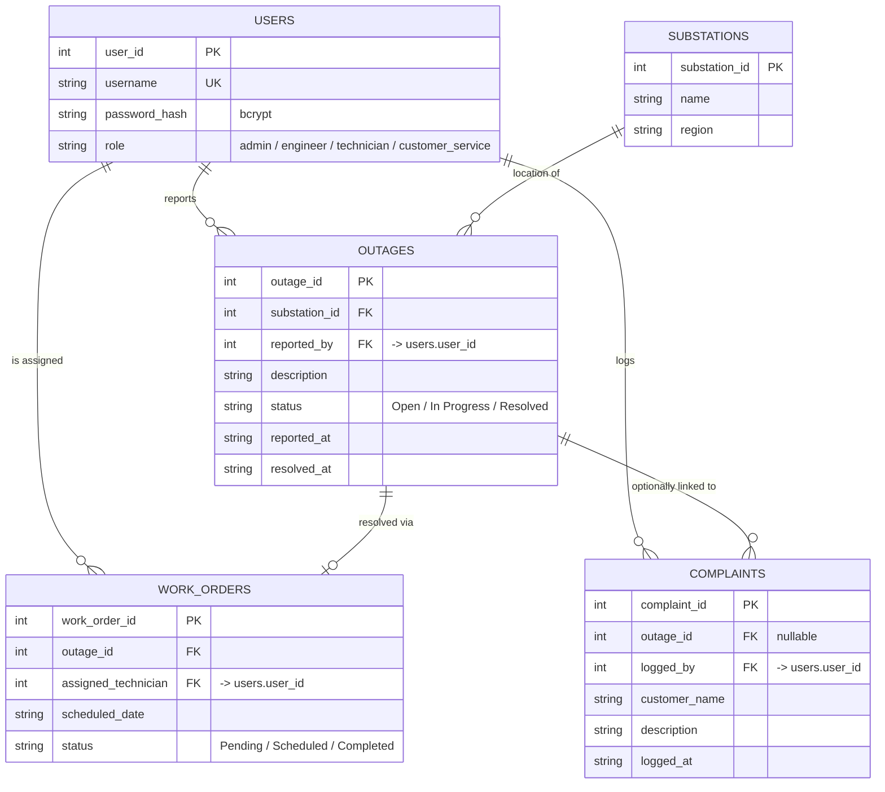

# Entity-Relationship Diagram — GridCare-Lite (`gridcare.db`)

Generated from the schema in `db.py`.

## Notes

- SQLite's `CHECK` constraints on `role`/`status` columns enforce the
  enumerations shown above at the database layer, not just in Python
  (`db.py`) — a direct `INSERT`/`UPDATE` outside `models.py` would still be
  rejected for an invalid role or status.
- `work_orders.outage_id` is not declared `UNIQUE` in the schema, so the
  "one outage, at most one active work order" rule shown as `||--o|` above
  is an application-level convention (`WorkOrder.assign` is only ever called
  from `WorkOrderForm` against `Outage.open_outages()`), not a DB constraint.
  Worth revisiting if GridCare-Lite ever needs to support re-assigning a
  failed repair.
