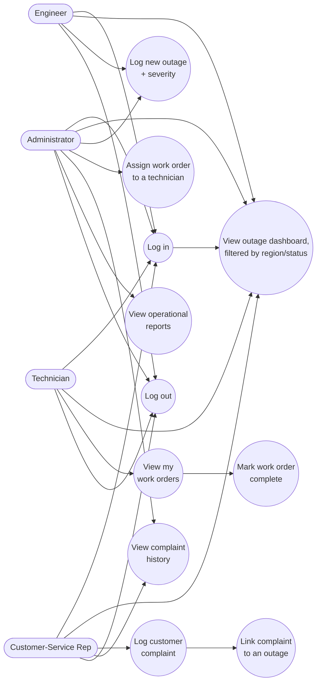

# Use-Case Diagram — GridCare-Lite

Four roles, each restricted to their own screens in `app.py`
(`OutageDashboard.__init__` builds the button bar conditionally on
`user.role`).

## Actor -> permitted action matrix

| Action | Admin | Engineer | Technician | Customer Service |
|---|:---:|:---:|:---:|:---:|
| View outage dashboard, filter by region/status | Yes | Yes | Yes | Yes |
| Log new outage (with severity) | Yes | Yes | No | No |
| Assign work order | Yes | No | No | No |
| View own work orders | No | No | Yes | No |
| Mark work order complete | No | No | Yes | No |
| Log complaint | No | No | No | Yes |
| Link complaint to an outage | No | No | No | Yes (optional field) |
| View complaint history | Yes | No | No | Yes |
| View operational reports | Yes | No | No | No |
| Log out | Yes | Yes | Yes | Yes |

Enforced in two places, per the course spec's requirement that role
separation not be "merely hiding buttons":

1. **GUI** — `OutageDashboard` only adds the buttons relevant to
   `user.role`.
2. **Application logic** — e.g. `WorkOrder.for_technician(conn,
   technician_id)` only ever returns that technician's own rows; a
   technician can't fetch another technician's work orders even by calling
   the model method directly.

Still a known gap (see `docs/test_plan.md`, case GC-03): the model layer
itself doesn't re-check role for `WorkOrder.assign()` or similar - a
non-standard client bypassing the GUI could still call them directly.
Role separation today is GUI-button-level plus per-user data scoping, not
a role check inside every mutating method.
